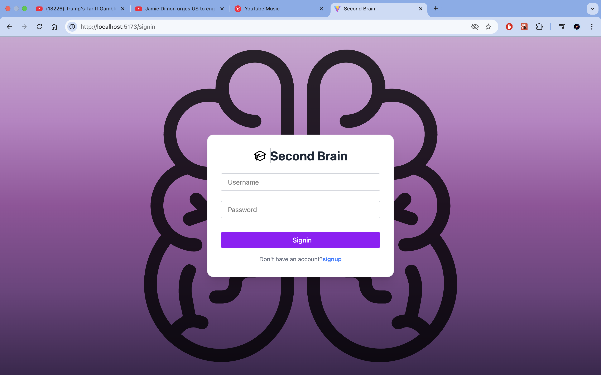

# 🧠 Second Brain – Centralized Content Storage App

Second Brain is a full-stack web application that allows users to organize, store, and manage all their digital content in one place — be it Tweets or YouTube videos. Designed with productivity and minimalism in mind, it acts as your digital memory companion.

---

## 🚀 Tech Stack

### 🖥️ Frontend
- **React**
- **Tailwind CSS**
- **TypeScript**
- **Zod** (for schema validation)

### ⚙️ Backend
- **Node.js**
- **Express.js**
- **MongoDB** (db)
- **JWT** (for authentication)

---

## ✨ Features

- 🔐 Secure login & signup with JWT auth
- 📌 Save content from Twitter and YouTube
- 🧹 Clean UI using Tailwind CSS
- 🚀 Fast and optimized APIs
- ✅ Form validation with Zod

---

## 📸 Screenshots

<p align="center">
  <strong>🔐 Signin / Signup Page</strong><br/>
  
</p>

<p align="center">
  <strong>📊 Dashboard View</strong><br/>
  
</p>

<p align="center">
  <strong>➕ Add Content Modal</strong><br/>
  
</p>

<p align="center">
  <strong>❌ Delete Content Modal</strong><br/>
  
</p>
---

## 🛠️ Getting Started

```bash
# Clone the repository


# Frontend Setup
cd 2ndBrainFE
npm install
npm run dev

# Backend Setup
cd ../SecondBrainBE
npm install
npm run dev
